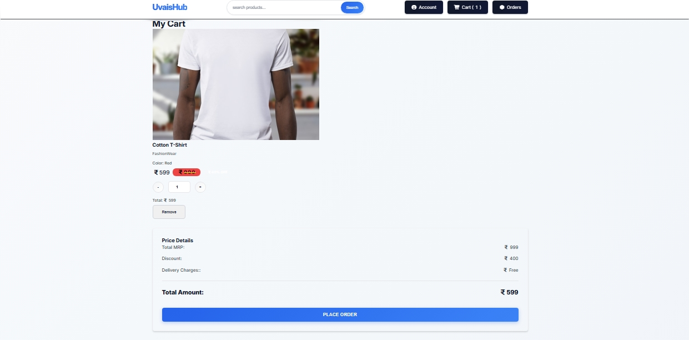
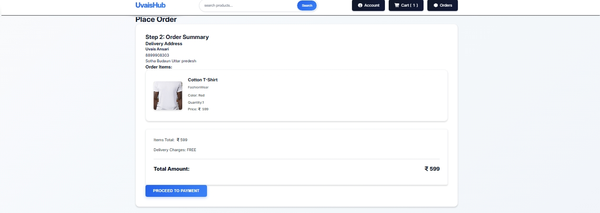
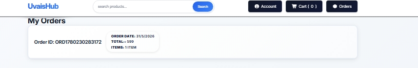
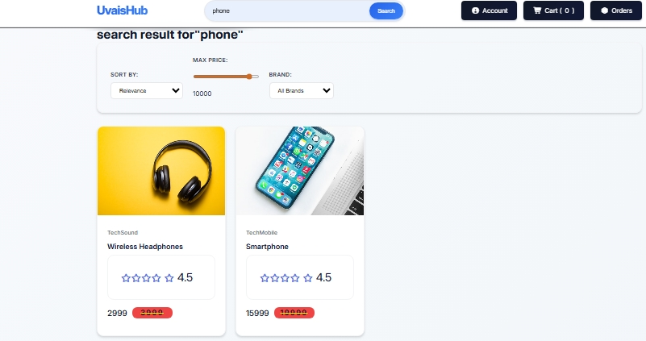
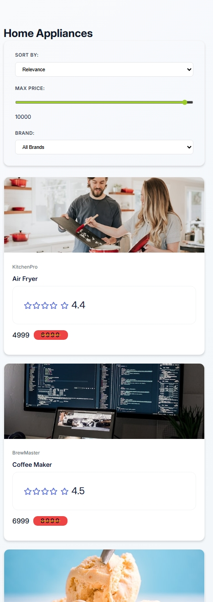
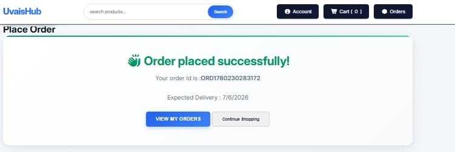
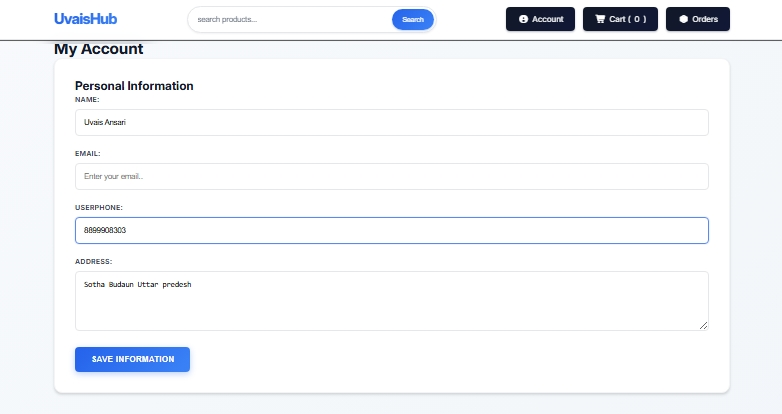

## 🛒 E-Commerce Website

A modern and responsive E-Commerce Website built using HTML, CSS and JavaScript.

## 🚀 Live Demo

Add your deployed website link here.

## ✨ Features

- Responsive Design
- Product Listing
- Product Search
- Add To Cart
- Remove From Cart
- Update Quantity
- Local Storage Support
- Mobile Friendly Interface

## 🛠 Technologies Used

- HTML5
- CSS3
- JavaScript (ES6)

## 📸 Screenshots

## Home page

## Products Page

## Cart Page

## My Order

## Order Id

## Payement Method

## Search-product

## Responsive for Mobile

## sidebar for mobile

## Place order

## My Account

## Responsive For Mobile

## Footer

## 📂 Folder Structure

NewProject/

├── assets/

│ └── screenshots/
 
 │ ├── images/

├── css/

│ ├── style.css

├── js/

│ ├── script.js

├── index.html

└── README.md

## 🔮 Future Improvements

- User Authentication
- Payment Gateway Integration
- Wishlist Feature
- Order History
- Backend Integration

## 👨‍💻 Author

Muhammad Uvais..

GitHub Profile: https://github.com/uvais8958